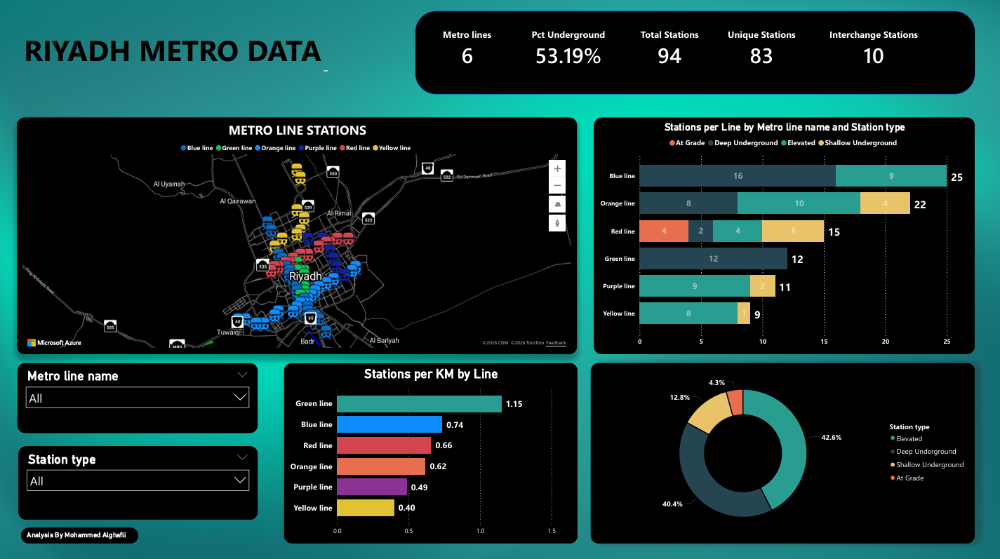
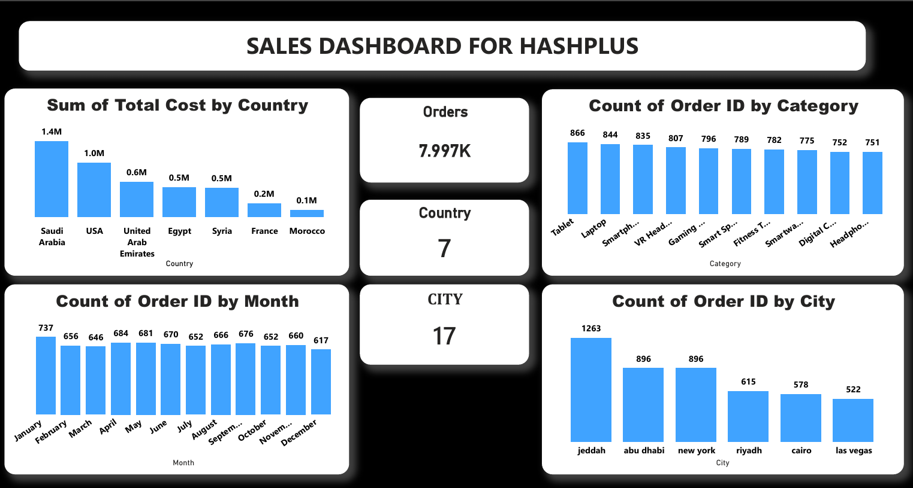

# Power BI Projects

This repository contains a collection of my Power BI dashboards, reports, and data visualization projects.

## Riyadh Metro Dashboard

An interactive Power BI dashboard built to analyze Riyadh Metro data, including metro lines, stations, and key insights.

## Tools Used
- Power BI
- Power Query
- DAX
- Excel
- Data Visualization

## Project File
You can find the Power BI file here:

[Download Riyadh Metro Dashboard](RIYADH%20METRO.pbix)

## Goal
The goal of this repository is to document my learning journey and showcase my skills in data analysis, dashboards, and business intelligence.

## Sales Dashboard

An interactive Power BI dashboard designed to analyze sales data, track performance, and present key business insights through clear visualizations.

### Project File
[Download Sales Dashboard](SALES.pbix)
